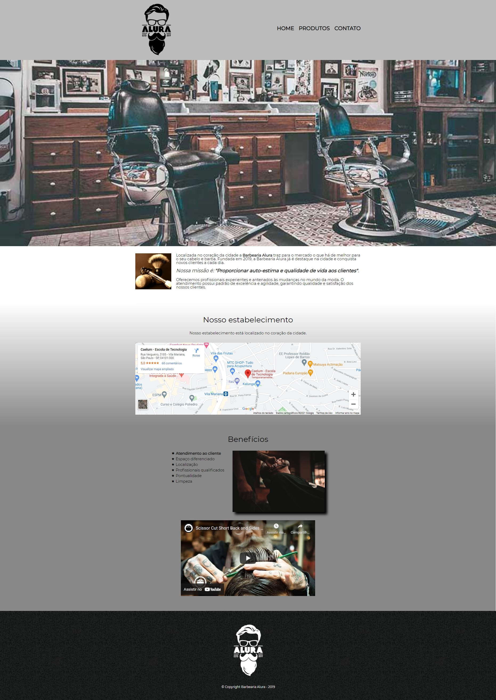

<h1 align="center">
    
</h1>

  :white_check_mark: <a href="https://andreadcsousa.github.io/alura_webpage_barbearia/" target="_blank">Veja a página</a>
    &nbsp;&nbsp;&nbsp; | &nbsp;&nbsp;&nbsp;
  :white_check_mark: <a href="https://www.alura.com.br/formacao-front-end" target="_blank">Conheça o curso</a>

# :computer: Projeto
 
- Idealizador: Alura
- Projeto: Formação Front-End
- Lado da força: Front-End
- Tipo: Introdução a HTML e CSS
- Etapa: Primeira página web

# :rocket: Tecnologias

# :art: Layout

